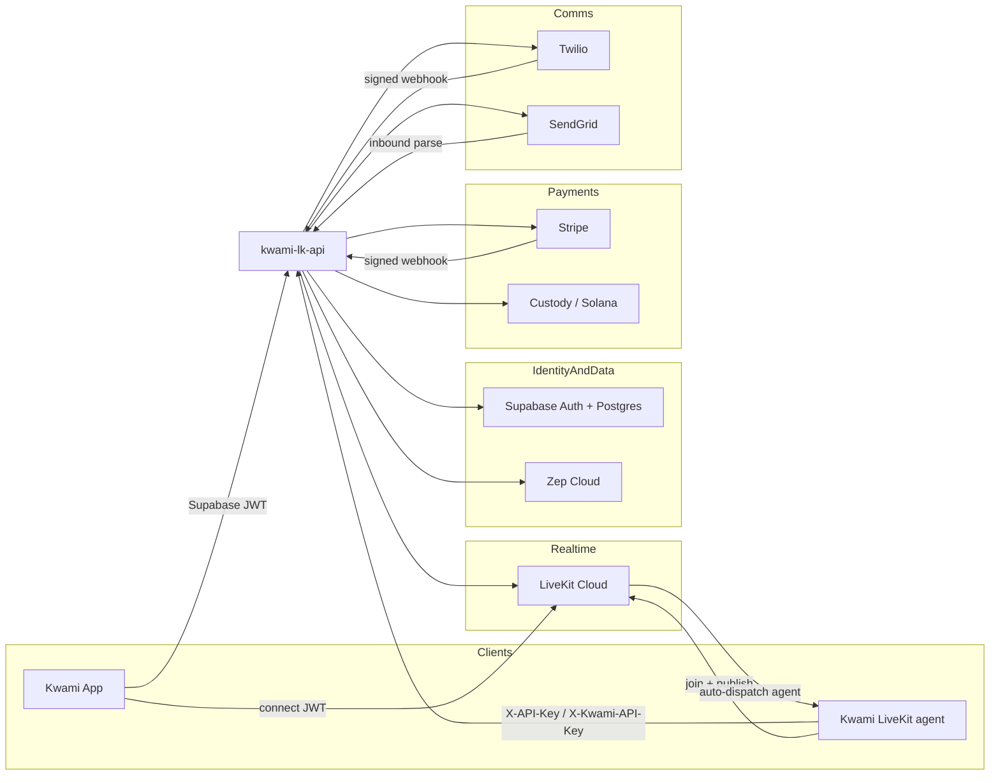
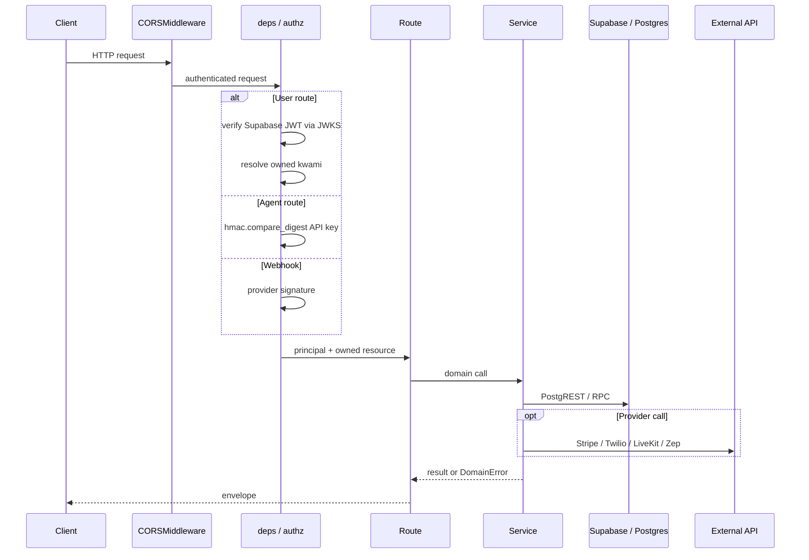
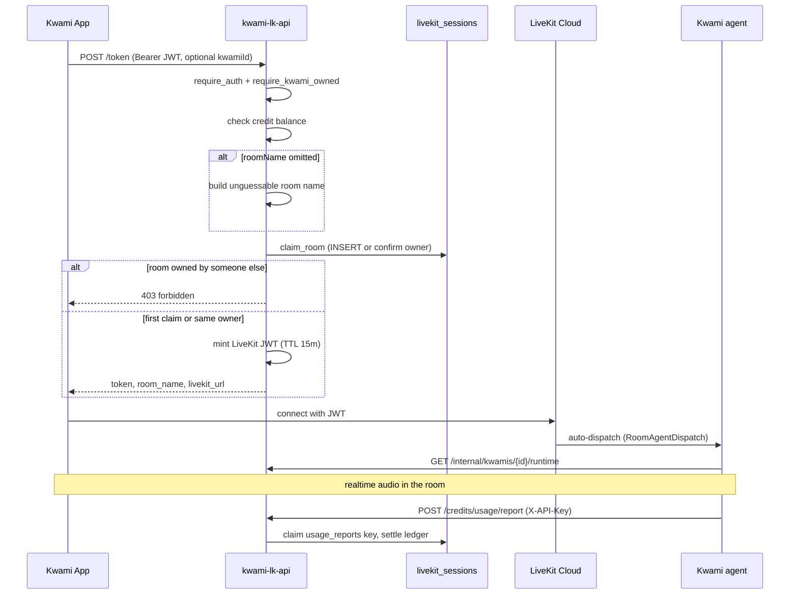
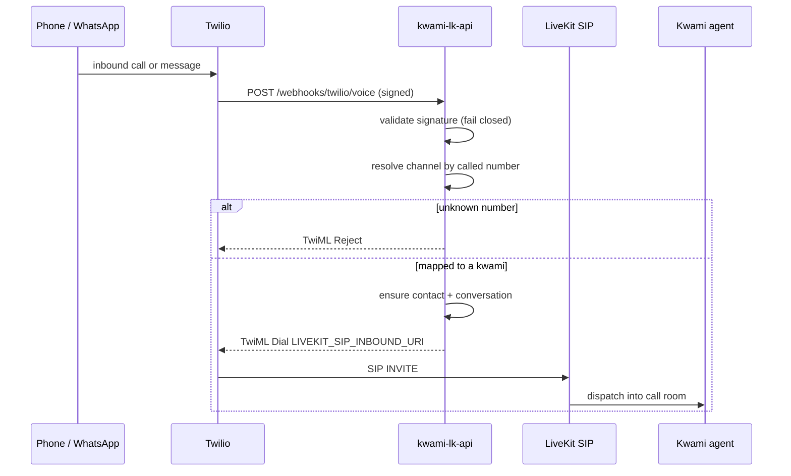

# Architecture

Kwami LiveKit API is the control plane for Kwami voice agents. It issues LiveKit
tokens, serves model and voice catalogs, stores per-kwami memory and
communications state, and settles money. It does not run the realtime agent
itself — that is a separate process that joins the room LiveKit Cloud dispatches.

The running process is a FastAPI app (`src/main.py`) on Python 3.11. Persistence
is Supabase (Postgres + Auth + PostgREST). Secrets and third-party credentials
are validated at boot by `src/core/config.py`; a missing required variable
refuses to start the process.

## System context



Two clients, two trust boundaries:

- **Kwami App** authenticates as a user. Every tenant-scoped route takes a
  Supabase JWT and resolves ownership before business logic runs.
- **Kwami LiveKit agent** authenticates as a service. Usage reports use
  `X-API-Key`; bootstrap/internal routes use `X-Kwami-API-Key`. Both compare
  against `KWAMI_API_KEY` in constant time.

Webhooks have no user. Stripe is verified by signature and a timestamp window;
Twilio is verified against the public URL and **fails closed** when
`TWILIO_AUTH_TOKEN` is unset.

## Process layout

```
src/
├── main.py                 FastAPI app, CORS, lifespan, router mount
├── api/
│   ├── deps.py             JWT, admin, internal API-key dependencies
│   ├── authz.py            Owned-kwami resolvers (path / query / body)
│   └── routes/             One module per HTTP surface
├── core/
│   ├── config.py           Pydantic settings, boot-time validation
│   ├── security.py         JWKS verification, AuthUser, admin checks
│   └── errors.py           Domain errors → stable HTTP envelope
└── services/               Integrations and ledger logic; no FastAPI types
```

Routes stay thin. Services raise typed `DomainError` subclasses; 
`install_error_handlers` maps them to status codes. Handlers do not forward
upstream `str(e)` to clients — that was the previous failure mode.

## Request path



Authorization is a dependency, not a check inside the handler. `kwami_id`
arrives as a path parameter, a query parameter, or a body field — three
shapes, one resolver in `src/services/kwamis.py`. An unowned kwami never
reaches business logic.

## Voice session

Token issuance is the one endpoint whose output is a credential. Room names
used to come from the client; any authenticated user could join any room by
guessing the name. Rooms are now claimed in `livekit_sessions` at issue time.
`UNIQUE(room_name)` is the arbiter, not a read-then-write in Python.



Agent dispatch is LiveKit Cloud's job. The API must not dispatch a second
agent into the same room. The token carries `RoomAgentDispatch` so the first
connect creates the agent; the API does not call the dispatch RPC.

Inbound phone calls take a different path to the same room:



Shared SIP trunks are platform infrastructure. Users buy numbers in the app;
the API attaches those numbers to the shared Twilio trunk and maps them to a
kwami. There is no per-kwami trunk to provision by hand.

## Catalogs

`/models`, `/voices`, and `/languages` are read-mostly. The lists are derived
from LiveKit plugin packages plus the YAML under `config/`:

| File | Feeds |
|------|--------|
| `config/livekit_inference_llm.yaml` | `/models/llm` |
| `config/livekit_inference_stt.yaml` | `/models/stt` |
| `config/livekit_inference_tts.yaml` | `/models/tts` |
| `config/livekit_voices.yaml` | `/voices/*` |
| `config/livekit_languages.yaml` | `/languages/*` |

Plugin packages are dependencies so the API can extract model IDs the agent
can actually load. They are not used to call the providers from this process.

## Memory

`/memory/{user_id}/...` is a Zep Cloud facade. Tenancy is
`src/core/security.py:check_user_access`: the authenticated user may read
their own id, the legacy `kwami_<user.id>` namespace, or a per-kwami
`kwami_<user.id>_*` namespace. Those three anchored checks are the whole
contract — a previous `str.replace` rule accepted namespaces that merely
contained the caller's id after mangling.

## Where money is decided

Python prices a usage item (`src/services/pricing.py`) and applies markup
(`BILLING_MARKUP_MULTIPLIER`). The **balance change** is a Postgres function.
`deduct_credits` is `UPDATE ... WHERE balance >= p_amount` in one statement;
`add_credits` is idempotent via a unique ledger key and
`ON CONFLICT DO NOTHING`. See [Billing](./billing.md).

## Environments

| `APP_ENV` | Docs | Credits fail-open | Wallets |
|-----------|------|-------------------|---------|
| `development` | on | on (unless set) | on (unless set) |
| `staging` | on | on (unless set) | on (unless set) |
| `production` | off unless `ENABLE_DOCS=true` | off | off unless `WALLET_ENABLED=true` |

Fly terminates TLS and forwards over the internal network. Uvicorn runs with
`proxy_headers=True` so `request.url.scheme` stays `https` — Twilio signs the
public HTTPS URL, and a scheme mismatch fails every inbound call.
