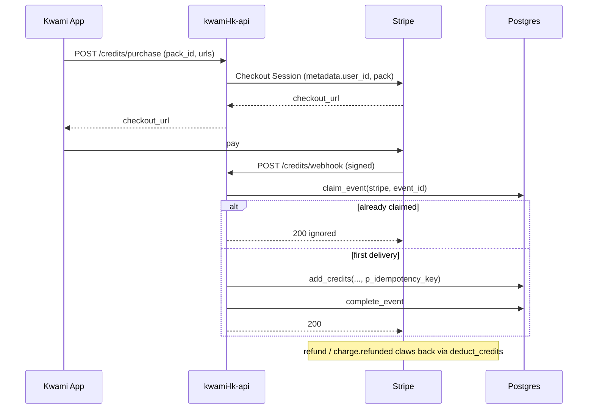
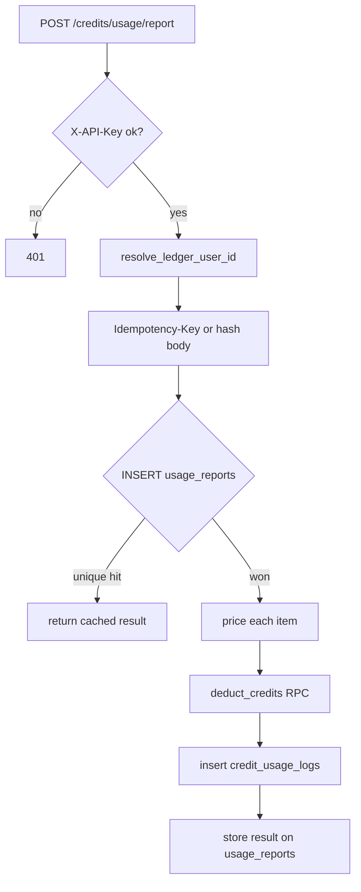

# Billing

Credits are the customer-facing unit. The ledger is in Postgres. Python
prices a usage item and applies markup; SQL is what actually moves the
balance. That split is deliberate: pricing can be wrong in a testable way,
overdraft cannot.

## Units

| Unit | Size |
|------|------|
| 1 display credit | 1 000 micro-credits |
| 1 display credit | $0.001 USD (`USD_PER_CREDIT`) |
| Spark pack | 5 000 credits / $5.00 |
| Surge pack | 25 000 credits / $25.00 |
| Overcharge pack | 100 000 credits / $100.00 |

Balances, ledger amounts, and usage charges are stored as **micro-credits**
(`bigint`). The API converts to display credits at the edge.

Pack ids in the API are still `starter` / `standard` / `pro`. The display
names above are what Stripe Checkout shows.

## Pricing

`src/services/pricing.py` is the source of truth for **provider cost**.
Customer policy is applied on top so the ledger can report revenue and
margin separately:

```
provider_cost_usd  = f(model, units)          # catalog
billed_cost_usd    = provider_cost * MARKUP + FIXED_FEE
micro_credits      = ceil(billed_cost_usd / USD_PER_CREDIT) * 1000
                   # actually: credits = billed / 0.001; micro = credits * 1000
```

`BILLING_MARKUP_MULTIPLIER` defaults to `2.0`. `BILLING_PRICING_VERSION`
(default `2026-03-20`) is written onto every usage row so a later catalog
change does not rewrite history.

Model types: `llm`, `stt`, `tts`, `realtime`, `tool`, `memory`. Token
models use input/output/cached-input per 1M. Audio models use per-minute
or per-1M-characters. Realtime models split audio minutes and optional
text tokens. Tools and Zep calls are per-request, configured via
`BILLING_*_PER_CALL_USD`.

Unknown models fall back to
`BILLING_FALLBACK_COST_PER_1M_TOKENS_USD` rather than charging zero.

## Purchase



`add_credits` is an RPC. The idempotency key is claimed in the same
transaction as the balance update, so a retried webhook cannot double
credit even if `payment_events` were somehow missed.

Refunds look up the original payment intent (stored on the first event)
and debit. A balance that has since been spent can go unpaid — that is
recorded, not silently ignored.

## Usage settlement

The LiveKit agent reports after a session (or on a heartbeat). It is not
the source of truth for *who* to charge.



Each usage row records:

| Column | Meaning |
|--------|---------|
| `provider_cost_usd` | Raw catalog cost |
| `billed_cost_usd` | After markup and fee |
| `margin_usd` | billed − provider |
| `requested_credits` | What the price said to charge |
| `credits_charged` | What the RPC actually took |
| `settlement_status` | `pending` / `charged` / `insufficient_credits` / `skipped` |
| `pricing_version` / `pricing_source` | Which catalog produced the number |

`deduct_credits` cannot overdraw. If the balance is short, the row is
`insufficient_credits` and `unpaid_credits` is returned on the report.
The session is not silently free and the balance is not negative.

`CREDITS_FAIL_OPEN_ON_CHECK_ERROR` only affects the **pre-session**
balance check on `/token`. Settlement itself does not fail open.

## Wallets

Optional, off in production until `WALLET_ENABLED=true`. Each kwami can
have a custody wallet (`kwami_wallets`) funded by:

- Phantom transfer intent
- Card-provider intent (`WALLET_CARD_PROVIDER_BASE_URL`)

Inbound funding webhooks share the `payment_events` claim and then call
`add_credits`. Mint allowlisting (`wallet_token_allowlist`) restricts
which SPL tokens credit the ledger. The default custody provider is
`mock` — deterministic keys for local tests, not a production signer.

Set `WALLET_CUSTODY_PROVIDER`, `WALLET_CUSTODY_SIGNING_SECRET`, and
`WALLET_WEBHOOK_SECRET` together when switching off mock.

## Reconciliation

`/admin/reconciliation` pulls or accepts vendor invoices (OpenAI, Tavily,
LiveKit Cloud, Zep) and diffs them against `credit_usage_logs`. Findings
are the gap between what we billed customers and what providers billed
us. It is an operator tool, not a user feature.

`GET /credits/reconciliation` is the per-user view of the same numbers.

## What the tests prove

`tests/integration/db/test_credit_functions.py` runs the RPCs against
Postgres. That is the only suite that can prove:

- two concurrent `deduct_credits` cannot overdraw
- a repeated `add_credits` with the same key credits once
- RLS hides another tenant's balance

`tests/unit/services/test_usage_settlement.py` and
`tests/unit/api/test_stripe_webhook.py` cover the Python claim/replay
paths with a fake PostgREST. They cannot prove the unique index.
