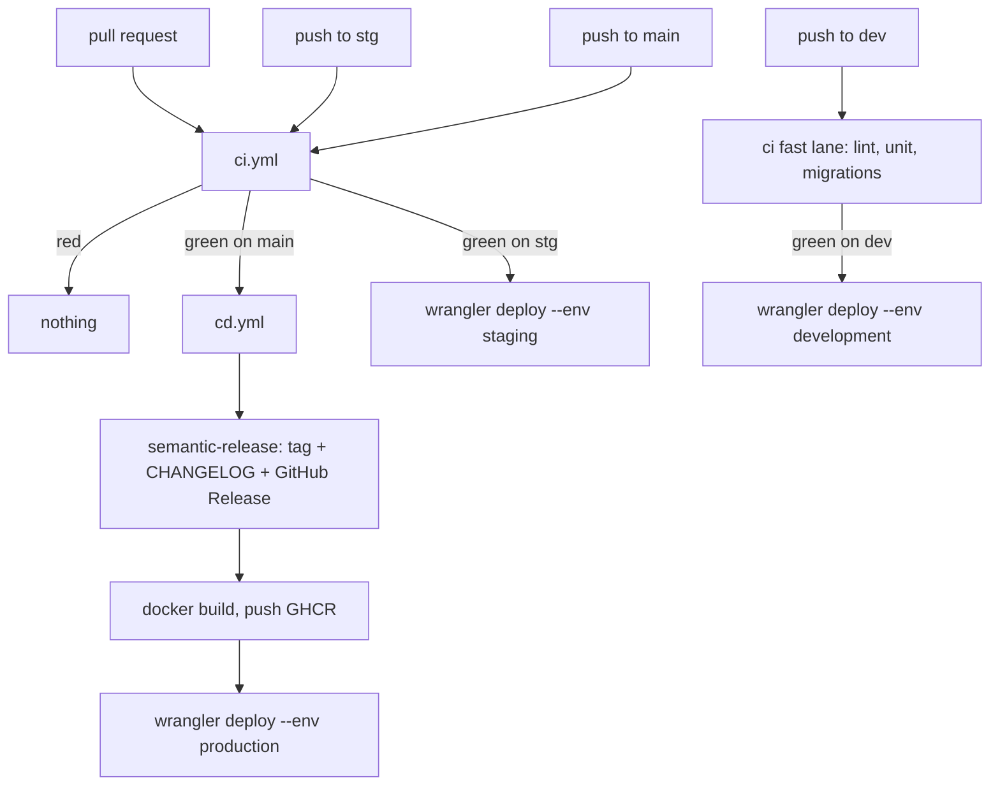

# Deployment

Nothing is released or shipped from a commit whose tests did not pass.
`cd.yml` is triggered by `workflow_run` on `ci`, not by a second `push`.

## Pipeline



Cloudflare is the live origin. The same `Dockerfile` is built twice on a
`main` run: once into GHCR (the archive) and once as the Container
behind the Worker. `stg` and `dev` skip the archive and deploy their
channel Workers only.

| Event | lint / unit / migrations | integration / coverage / build | vuln | cd |
|-------|--------------------------|--------------------------------|------|----|
| pull request | yes | yes | advisory | no |
| push `dev` | yes | no | no | deploy `kwami-lk-api-dev` |
| push `stg` | yes | yes | advisory | deploy `kwami-lk-api-stg` |
| push `main` | yes | yes | advisory | **release, publish, deploy `kwami-lk-api`** |

The fast lane on `dev` is a shorter feedback loop, not a lower bar. Every
pull request still runs the full suite, so nothing reaches `main` without
it.

`main` CI runs are never cancelled. A force-push on `dev` or `stg`
cancels the run it superseded.

## Release

Versions, tags, the GitHub Release, and [CHANGELOG.md](../CHANGELOG.md)
are generated from Conventional Commit history by semantic-release.
Nothing is hand-maintained. The **pull request title** is the commit that
lands — squash merge is required — so a non-conventional title is
silently unreleasable work.

The service is **1.x**. [`.releaserc.json`](../.releaserc.json) maps plain
semver: `feat!:` or a `BREAKING CHANGE:` footer bumps the **major**, `feat:`
the **minor**, and every other conventional type a **patch**. Every
conventional type is releasable; only `feat`, `fix`, `perf`, `revert`, and
breaking changes get a heading in the changelog.

The preset is `conventionalcommits`, not `angular`. `angular` does not
understand the `!` marker: under it a `feat!:` title cut no release at all
while `publish` and `deploy` still ran, shipping the change under the
previous version. The preset is not bundled with semantic-release either —
`cd.yml` installs `conventional-changelog-conventionalcommits` in its
`npx -p` list.

`v0.1.0` is a baseline tag at the commit that introduced this automation,
and `v0.1.1` is the last release of the pre-1.0 line. Without a baseline,
semantic-release would treat the repository as a fresh 1.0.0 and pull the
entire pre-automation history into the first changelog.

`scripts/set-version.sh` writes the version in four places:

- `pyproject.toml`
- `uv.lock` (the one `uv lock --check` gates)
- `src/__init__.py` (what the running service reports)
- the README badge

The release commit is pushed with a token that triggers no workflow. That
stops `cd → tag → cd`. It also means the `chore(release):` commit is never
itself built — the image and the deploy come from the commit `ci` tested,
one behind. The tag and changelog are correct; the deployed tree is a
changelog commit short.

That push lands on protected `main`, so something has to bypass the
pull-request rule. It is **not** the `github-actions` app: that app is not
installed on the `kwami-labs` organisation, and naming it makes GitHub
reject the whole ruleset with `422`. The bypass actor in
[`.github/rulesets/main.json`](../.github/rulesets/main.json) is the
**repository admin role**, and the release pushes as an admin using
`RELEASE_TOKEN` — a fine-grained PAT with `Contents: Read and write`.
`cd.yml` refuses to start a release without it whenever a branch ruleset is
active. See [CONTRIBUTING.md](../CONTRIBUTING.md#the-release-needs-release_token).

## Images

| Tag | When |
|-----|------|
| `1.4.2`, `1.4` | a version was cut on this run |
| `main` | every green run on `main` |
| `sha-<full sha>` | every green run on `main` |

Registry: `ghcr.io/kwami-labs/kwami-lk-api`.

GHCR is the archive, not what Cloudflare runs. `wrangler deploy` builds
the same `Dockerfile` from the same commit as a Container. The trade is
a second build rather than giving Cloudflare credentials for a private
GHCR package.

The image is `python:3.11-slim`, installs `uv`, runs
`uv sync --frozen --no-dev`, and starts with
`uv run python -m src.main`. `.python-version` is `3.11` locally and in
CI for the same reason: coverage percentages shift between interpreters.

Two things in it are deliberate. The `uv` binary comes from a **pinned**
`ghcr.io/astral-sh/uv` tag rather than `:latest` — with a floating tag,
two builds of the same commit can resolve different uv versions, which is
the thing a version number exists to rule out. And the process runs as
the unprivileged `app` user (uid 10001), not root: it binds 8080, which
needs no privilege, and writes nothing outside the virtualenv.
`UV_FROZEN` and `UV_NO_SYNC` stop `uv run` from trying to re-resolve and
rewrite the lockfile at start-up, which that user cannot do and should
not — the image ships the environment it was built with.

## Cloudflare

The same FastAPI image runs as a [Cloudflare Container] behind a Worker.
[`infra/`](../infra) holds the whole target: `wrangler.jsonc`, the Worker
in `src/index.ts`, and Terraform for the DNS and custom-domain side.

| Piece | Where |
|-------|-------|
| Worker + Container config | [`infra/wrangler.jsonc`](../infra/wrangler.jsonc) |
| Worker entry (proxies to the container) | [`infra/src/index.ts`](../infra/src/index.ts) |
| Container env from Worker vars/secrets | [`infra/src/container-env.ts`](../infra/src/container-env.ts) |
| Secrets upload | [`infra/scripts/put-secrets.sh`](../infra/scripts/put-secrets.sh) |
| DNS / custom domain | [`infra/terraform/`](../infra/terraform) |

`KwamiApiContainer` is a Durable Object owning one container instance on
port 8080, with `/health` as its ping endpoint and `sleepAfter = "10m"`.
The Worker sets `X-Forwarded-Proto`, `X-Forwarded-Host` and
`X-Forwarded-For` from `CF-Connecting-IP` before proxying. Uvicorn
runs with `proxy_headers=True`: Twilio signs the HTTPS URL, so a
request that arrives looking like `http` fails signature validation.

The container image is `"image": "../Dockerfile"` — the same file GHCR
builds. One Dockerfile, two consumers.

Deploys go through
[`.github/actions/cloudflare-deploy`](../.github/actions/cloudflare-deploy/action.yml).
`CLOUDFLARE_API_TOKEN` and `CLOUDFLARE_ACCOUNT_ID` are required; a
missing credential fails the job. The token belongs to
Admin@nexow.ai's account (`132a7551ad4a90e979a18f7c4cfd364e`).

| GitHub Environment | Wrangler env | Worker | URL |
|---|---|---|---|
| `production` | `production` | `kwami-lk-api` | `https://kwami-lk-api.nexow.workers.dev` |
| `stg` | `staging` | `kwami-lk-api-stg` | `https://kwami-lk-api-stg.nexow.workers.dev` |
| `development` | `development` | `kwami-lk-api-dev` | `https://kwami-lk-api-dev.nexow.workers.dev` |

`kwami-app` bakes `VITE_API_URL` to the matching URL at build time.

Run it by hand from `infra/` with `pnpm install && pnpm exec wrangler deploy --env <env>`.

[Cloudflare Container]: https://developers.cloudflare.com/containers/

## Required status checks

Every job in `ci.yml` except `vuln` is required on `main`:

| Check | Fails when |
|-------|------------|
| `pr-title` | title is not a Conventional Commit |
| `lint` | ruff, or `uv.lock` no longer matches `pyproject.toml` |
| `unit` | hermetic lane fails |
| `integration` | migrations or money invariants fail against Postgres |
| `coverage` | a module is below its floor, or has no floor and no exclusion |
| `migrations` | duplicate or unorderable prefixes |
| `build` | the release image does not build |
| `vuln` | advisory — pip-audit, `continue-on-error` |

Apply the ruleset with `make rules` (`./scripts/branch-protection.sh`).
Until that has been run, `main` is unprotected and the JSON in
`.github/rulesets/` is just JSON.

## Local stand-in

```bash
make hooks    # refuse a direct push to main
make rules    # apply the GitHub ruleset (needs admin)
```

The hook lives in the working copy. `git push --no-verify` walks past it.
It is a guardrail against the accident; the ruleset is the control.
