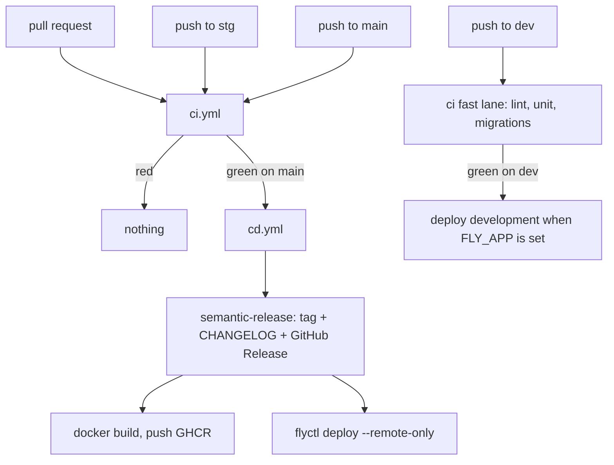

# Deployment

Nothing is released or shipped from a commit whose tests did not pass.
`cd.yml` is triggered by `workflow_run` on `ci`, not by a second `push`.

## Pipeline



| Event | lint / unit / migrations | integration / coverage / build | vuln | cd |
|-------|--------------------------|--------------------------------|------|----|
| pull request | yes | yes | advisory | no |
| push `dev` | yes | no | no | development deploy, if configured |
| push `stg` | yes | yes | advisory | no |
| push `main` | yes | yes | advisory | **release, publish, deploy production** |

The fast lane on `dev` is a shorter feedback loop, not a lower bar. Every
pull request still runs the full suite, so nothing reaches `main` without
it.

`main` CI runs are never cancelled. A force-push on `dev` or `stg`
cancels the run it superseded.

## Release

Versions, tags, the GitHub Release, and [CHANGELOG.md](../CHANGELOG.md)
are generated from Conventional Commit history by semantic-release.
Nothing is hand-maintained. The **pull request title** is the commit that
lands — squash merge is required — so a non-conventional title is
silently unreleasable work.

The service is pre-1.0. [`.releaserc.json`](../.releaserc.json) maps
**breaking → minor** and everything else → patch: `feat!:` bumps
`0.3.x → 0.4.0`, not `1.0.0`. Every conventional type is releasable; only
`feat`, `fix`, `perf`, and `revert` get a heading in the changelog.

`v0.1.0` is a baseline tag at the commit that introduced this automation.
Without it, semantic-release would treat the repository as a fresh 1.0.0
and pull the entire pre-automation history into the first changelog.

`scripts/set-version.sh` writes the version in four places:

- `pyproject.toml`
- `uv.lock` (the one `uv lock --check` gates)
- `src/__init__.py` (what the running service reports)
- the README badge

The release commit is pushed with `GITHUB_TOKEN`, which triggers no
workflow. That stops `cd → tag → cd`. It also means the `chore(release):`
commit is never itself built — the image and the deploy come from the
commit `ci` tested, one behind. The tag and changelog are correct; the
deployed tree is a changelog commit short.

That push lands on protected `main`, so the `github-actions` app is a
bypass actor in [`.github/rulesets/main.json`](../.github/rulesets/main.json).

## Images

| Tag | When |
|-----|------|
| `1.4.2`, `1.4` | a version was cut on this run |
| `main` | every green run on `main` |
| `sha-<full sha>` | every green run on `main` |

Registry: `ghcr.io/kwami-labs/kwami-lk-api`.

GHCR is the archive, not what Fly runs. `flyctl deploy --remote-only`
builds the same `Dockerfile` from the same commit on Fly's builders.
Pointing Fly at GHCR would need registry credentials on the Fly side for
a package that is private by default — the trade is a second build
rather than a second credential.

The image is `python:3.11-slim`, installs `uv`, runs
`uv sync --frozen --no-dev`, and starts with
`uv run python -m src.main`. `.python-version` is `3.11` locally and in
CI for the same reason: coverage percentages shift between interpreters.

## Fly.io

[`fly.toml`](../fly.toml) names the production app (`kwami-ai-api`) in
`lhr`.

| Setting | Value | Why |
|---------|-------|-----|
| `internal_port` | 8080 | matches `API_PORT` |
| `force_https` | true | Twilio signs the HTTPS URL |
| `auto_stop_machines` | stop | scale to zero |
| `min_machines_running` | 0 | same |
| HTTP check | `GET /health` every 30s | liveness |
| VM | 1 shared CPU, 512 MB | current size |

Secrets live in `fly secrets`, not the repo. `FLY_API_TOKEN` is the
GitHub secret. `make deploy` is the manual escape hatch.

There is one Fly app today. `deploy · development` skips — green — until
`FLY_APP` is set as a variable on the `development` GitHub Environment.
The app name, not the token, enables the tier: `FLY_API_TOKEN` is already
a repository secret, and without a second app name `dev` would ship to
production. [`.github/actions/fly-deploy`](../.github/actions/fly-deploy/action.yml)
refuses that fallback.

Add a `staging` job and `stg` to the `cd.yml` trigger when a staging app
exists.

Uvicorn runs with `proxy_headers=True` and `forwarded_allow_ips="*"`.
Only the Fly proxy can reach the port. Without forwarded headers,
`request.url.scheme` stays `http` and Twilio signature checks fail.

## Required status checks

Every job in `ci.yml` except `vuln` is required on `main`:

| Check | Fails when |
|-------|------------|
| `pr-title` | title is not a Conventional Commit |
| `lint` | ruff, or `uv.lock` no longer matches `pyproject.toml` |
| `unit` | hermetic lane fails |
| `integration` | migrations or money invariants fail against Postgres |
| `coverage` | a module is below its floor, or has no floor and no exclusion |
| `migrations` | duplicate or unorderable prefixes |
| `build` | the release image does not build |
| `vuln` | advisory — pip-audit, `continue-on-error` |

Apply the ruleset with `make rules` (`./scripts/branch-protection.sh`).
Until that has been run, `main` is unprotected and the JSON in
`.github/rulesets/` is just JSON.

## Local stand-in

```bash
make hooks    # refuse a direct push to main
make rules    # apply the GitHub ruleset (needs admin)
```

The hook lives in the working copy. `git push --no-verify` walks past it.
It is a guardrail against the accident; the ruleset is the control.
