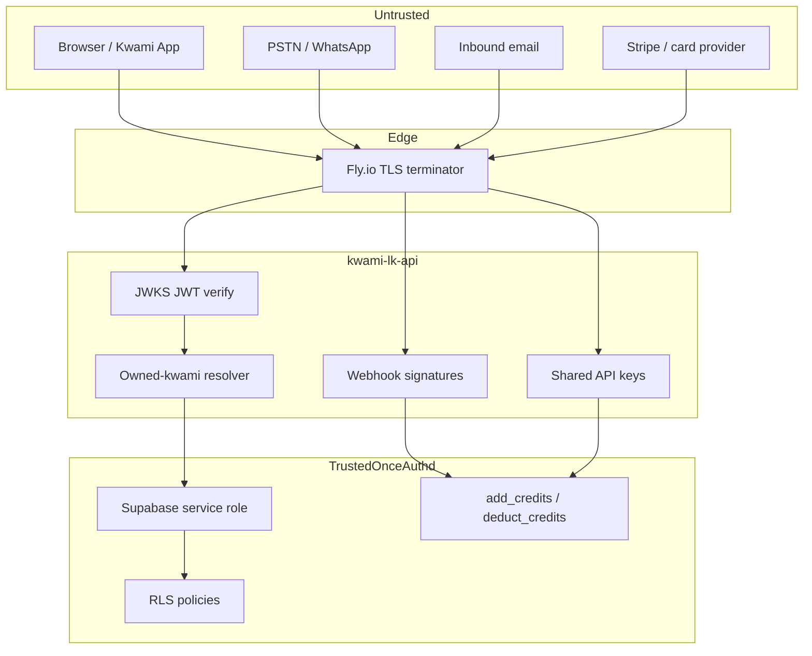

# Security

How to **report** a vulnerability is in [SECURITY.md](../SECURITY.md) at the
repository root — GitHub links that file from the Security tab. This page is
the model: what is trusted, what is not, and which invariants are enforced
in SQL rather than Python.

Do not open a public issue or pull request for a security problem.

## Trust boundaries

Anything that reaches the process from the internet is untrusted, including
a valid JWT. A JWT proves *who* the caller is; it does not prove they own
the `kwamiId`, `roomName`, or `user_id` in the body. Those are resolved
server-side.

The Supabase service role key bypasses RLS. It is used because several
writes (ledger RPCs, session claims, webhook settlement) must succeed
regardless of `auth.uid()`. That makes the key equivalent to the database:
treat a leak as a data breach.

## Authentication

### Users

`src/core/security.py:verify_token` fetches the signing key from the
Supabase JWKS, using the algorithm in the token header and audience
`authenticated`. Tokens are not decoded unsigned and then trusted.

`check_user_access` is the memory-namespace contract. The caller may use:

1. their own `sub`
2. the legacy `kwami_` namespace
3. a per-kwami `kwami__*` namespace

Those checks are anchored. A previous `str.replace("kwami_", "")` accepted
ids that merely contained the caller's id after mangling.

### Agents

`KWAMI_API_KEY` is a shared secret between this API and the LiveKit agent.
Two headers are accepted because the surfaces grew at different times:

- `X-API-Key` on `POST /credits/usage/report`
- `X-Kwami-API-Key` on `/internal/*`

Both use `hmac.compare_digest`. An unset `KWAMI_API_KEY` makes usage
reports 503 rather than open.

### Admins

`X-Admin-API-Key` compared to `ADMIN_API_KEY`, or a JWT whose email is in
`ADMIN_EMAILS`, or role `service_role`. Reconciliation imports vendor
invoices; that is not a user feature.

## Token issuance

`POST /token` mints a LiveKit JWT. A leaked token is a seat in a room.

- Default TTL is 15 minutes (`LIVEKIT_TOKEN_TTL_MINUTES`, max 6 hours).
- Room names are server-generated when omitted.
- `livekit_sessions.room_name` is `UNIQUE`. The first user to be issued a
  token for a name owns it; a later requester who is not that user gets
  403. A race is resolved by the unique constraint, then a re-read.
- `kwamiId` is resolved with `require_kwami_owned` before the token is
  minted, so an agent cannot be dispatched carrying someone else's config.

The usage-report path should charge the session owner recorded here, not
whatever `user_id` the agent sends. `resolve_ledger_user_id` maps aliases
and kwami ids back to `auth.users.id`.

## Webhooks

Unauthenticated input. Safety is the signature plus an idempotency claim.

| Endpoint | Verification | Replay guard |
|----------|--------------|--------------|
| `POST /credits/webhook` | Stripe-Signature, timestamp window | `payment_events (provider, event_id)` unique |
| `POST /webhooks/twilio/*` | Twilio request signature vs public URL | fail closed if `TWILIO_AUTH_TOKEN` unset |
| `POST /webhooks/email/inbound` | `SENDGRID_INBOUND_WEBHOOK_SECRET` | treat unset as an incident |
| `POST /wallets/webhooks/{provider}` | `WALLET_WEBHOOK_SECRET` | same `payment_events` claim |

`claim_event` is an `INSERT` that either wins or hits the unique index.
A read-then-write check has a window in which two deliveries both proceed.

Twilio signs the **public HTTPS URL**. Fly terminates TLS, so Uvicorn must
see `https` via `proxy_headers=True`. A scheme mismatch rejects every
legitimate call and looks like an outage.

`STRIPE_WEBHOOK_SECRET` or `SENDGRID_INBOUND_WEBHOOK_SECRET` unset means
the endpoint accepts forged events. That is an incident, not a
configuration gap.

## Money invariants

These are proven by `tests/integration/db/`, which run against a real
Postgres on every pull request. A change that only passes the unit lane
has not been tested.

- **No overdraft.** `deduct_credits` is
  `UPDATE user_credits SET balance = balance - p_amount WHERE balance >= p_amount`
  in one statement. Two concurrent deducts cannot both succeed past zero.
- **Idempotent credit.** `add_credits` takes `p_idempotency_key`. A unique
  index plus `ON CONFLICT DO NOTHING` makes a retried Stripe event a no-op.
- **Idempotent usage.** `usage_reports.report_key` is unique. The report is
  claimed before any debit; a replay returns the cached result.
- **Tenant isolation.** RLS on ledger, kwamis, sessions, channels, wallets.
  The API still has to pass the right `user_id` — RLS is the backstop for
  anything that uses the user JWT against PostgREST directly, not a
  substitute for `require_kwami_owned`.

`CREDITS_FAIL_OPEN_ON_CHECK_ERROR` defaults on outside production so a
billing outage does not block local token issuance. It is off in
production. Do not turn it on there.

## Secrets

Never commit `.env`. `.gitignore` blocks `.env` and `.env.*` except
[`.env.sample`](../.env.sample), which holds names and placeholders.

Runtime configuration is validated at boot. The process refuses to start
when a required variable is missing.

| Secret | Rotate in |
|--------|-----------|
| `LIVEKIT_API_SECRET` | LiveKit Cloud + Fly |
| `SUPABASE_SECRET_KEY` | Supabase + Fly |
| `STRIPE_SECRET_KEY` / `STRIPE_WEBHOOK_SECRET` | Stripe + Fly |
| `TWILIO_AUTH_TOKEN` | Twilio + Fly |
| `SENDGRID_API_KEY` / `SENDGRID_INBOUND_WEBHOOK_SECRET` | SendGrid + Fly |
| `ZEP_API_KEY` | Zep + Fly |
| `KWAMI_API_KEY` | agent deploy + Fly, together |
| `ADMIN_API_KEY` | operators + Fly |
| `WALLET_CUSTODY_SIGNING_SECRET` / `WALLET_WEBHOOK_SECRET` | custody + Fly |
| `FLY_API_TOKEN` | GitHub Actions secrets |

`GITHUB_TOKEN` is the only credential `cd.yml` uses for the release and
GHCR. Deploy credentials live in GitHub Environments and `fly secrets`,
not the repo.

If you believe a secret has been exposed, rotate it first, then report it.

## CORS and docs

`CORS_ORIGINS=*` is the development default. In production the settings
object logs a warning if `*` is still present — set explicit origins.
`allow_credentials=True` with `*` is a browser-incompatible combination;
do not ship it.

OpenAPI is off in production unless `ENABLE_DOCS=true` — all three of
`/docs`, `/redoc` and `/openapi.json`. The schema describes admin and webhook
routes; treat it as sensitive. It is the schema that matters: the two UIs only
render it, and closing them while leaving `/openapi.json` served published the
whole route map anyway. `src.main.docs_urls` returns the three together for that
reason, and `tests/unit/api/test_docs_exposure.py` holds them together.

## Dependency advisories

`make vuln` / the `vuln` CI job runs pip-audit over the locked set. It is
**advisory** today — see [CONTRIBUTING.md](../CONTRIBUTING.md#ci). Read
the job output; Dependabot opens the bumps weekly.

## What a review should look at

A change that touches any of these needs the integration lane, not just
units:

- `migrations/*.sql`, especially ledger functions, unique indexes, RLS
- `src/core/security.py`, `src/api/deps.py`, `src/api/authz.py`
- `src/services/sessions.py` (room ownership)
- `src/services/credits.py`, `src/services/idempotency.py`, Stripe / wallet
  webhook handlers
- Twilio signature validation and `APP_PUBLIC_URL`
